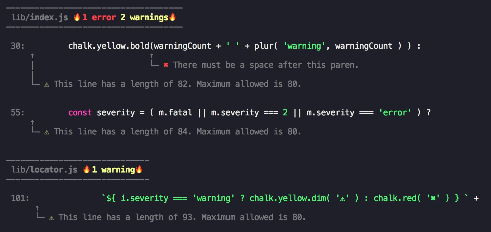

# eslint-formatter-formattify


A Custom beautiful eslint formatter.



# Installation

```bash
yarn add eslint-formatter-formattify --dev
```

or

```bash
npm i eslint-formatter-formattify -D
```

# Usage

`eslint [directory] -f formattify`

# License

MIT
